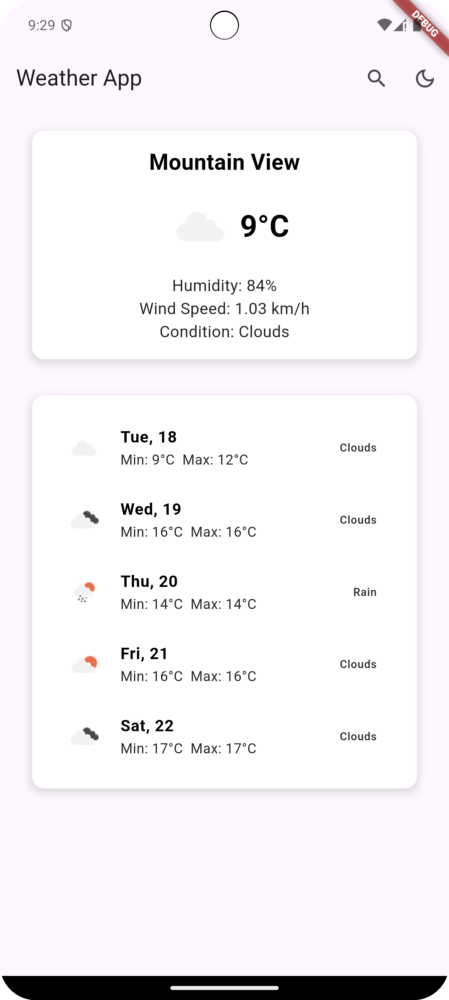
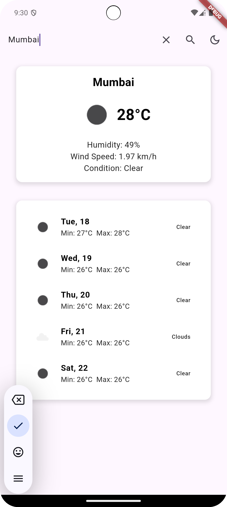

---

# Weather App

A weather application built using Flutter that allows users to view weather data based on their location, search for weather by city, and toggle between light and dark modes. It integrates data from a weather API and provides a clean and intuitive UI for users.

---

## Setup Instructions

### Prerequisites

Before setting up the project, ensure you have the following installed:

- Flutter SDK: [Install Flutter](https://flutter.dev/docs/get-started/install)
- Dart SDK (comes with Flutter)
- A code editor like [Visual Studio Code](https://code.visualstudio.com/) or [Android Studio](https://developer.android.com/studio)
- A physical device or an emulator to run the app

### API Key Setup

1. **Obtain a Weather API key**:
    - Sign up at [OpenWeatherMap](https://openweathermap.org/api) to get your free API key.
    - Copy your API key.

2. **Configure the API Key**:
    - In the project, open the file `lib/services/weather_api_service.dart` (or wherever the API call is made).
    - Add your API key in the appropriate place in the code (typically in the base URL or headers).
    - Example:

      ```dart
      final String apiKey = 'YOUR_API_KEY'; // Replace with your actual API key
      ```

---

## Architecture and Design Choices

### Architecture

This project follows a **BLoC (Business Logic Component)** architecture with **Flutter**:

- **BLoC**: The `WeatherBloc` is responsible for managing the weather data, fetching the data from the API, and emitting states like `WeatherLoading`, `WeatherLoaded`, and `WeatherError` based on the data fetch results.

- **UI and Views**: The UI is built using a `MaterialApp`, which contains a `HomeScreen` widget. The home screen allows users to search for weather by city, toggle dark/light mode, and pull-to-refresh for new data.

- **State Management**: The app uses **BLoC** to manage the state of the weather information. The state of the app (weather data, loading, errors) is managed by the `WeatherBloc` class and communicated with the UI through `BlocBuilder`.

### Design Choices

- **User Location**: The app fetches the user’s current location using the `Geolocator` package. If location permission is granted, the app retrieves the weather data based on the current coordinates.
- **Search Feature**: The app allows users to search for weather by city name, which triggers a request to the weather API.
- **Dark/Light Mode**: The app allows users to toggle between dark and light modes. The choice is saved using `SharedPreferences` to persist across app restarts.
- **Pull-to-Refresh**: The app includes a pull-to-refresh feature that fetches the latest weather data when the user pulls down on the screen.

---

## Screenshots

### Splash Screen (Default)
 

### Home Screen (Search Mode)


### Search Screen (Search Mode)
 

---
Download APK

Download the latest APK from the following link:  
[Download APK](apk/weather_app_v1.apk)

---
## Installation

1. Clone this repository to your local machine:

   ```bash
   git clone https://github.com/HarshalGupta113/Flutter-Weather-App-.git
   ```

2. Navigate to the project directory:

   ```bash
   cd weather_app
   ```

3. Install the dependencies:

   ```bash
   flutter pub get
   ```

4. Run the app on a physical device or emulator:

   ```bash
   flutter run
   ```

---

## Features

- **Weather data**: View current weather information based on location or city name.
- **Search functionality**: Search for weather by city name.
- **Dark/Light Mode toggle**: Toggle between dark and light themes.
- **Pull-to-refresh**: Refresh weather data by pulling down on the screen.

---
